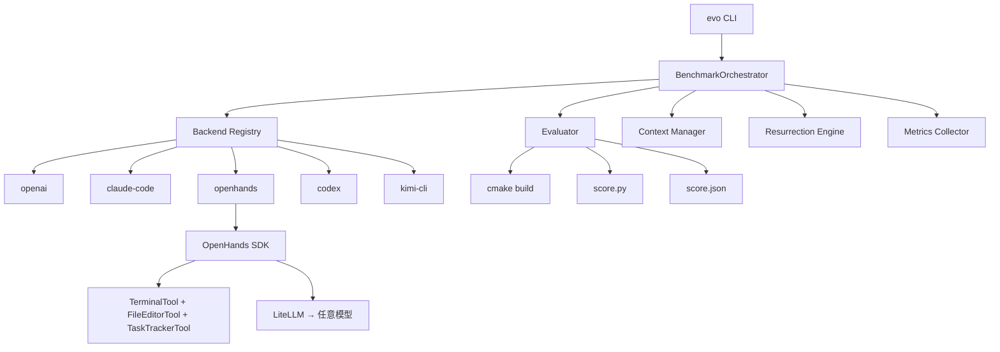

# EvoBench 架构文档

## 系统架构



## 核心流程

### 评测流水线

1. **初始化**: CMake 配置 + 生成标准答案
2. **逐 Task 评测**:
   - 组装上下文（README + 代码树 + 错误日志）
   - Agent 编码（自循环迭代）
   - CMake 构建
   - score.py 评分
   - 解析 score.json
3. **复活判断**: 分数 < 60% → 修改 config.cmake → 重新配置 → 重试
4. **报告生成**: JSON + CSV + Markdown

### 复活机制

```
Task N 失败 → 修改 config.cmake（TASK{N..5}_REVIVE=ON）
           → 重新 cmake 配置
           → 重新生成 Task N 标准答案
           → Agent 用标准答案作为输入继续 Task N+1
```

## Agent 后端抽象

```python
class AgentBackend(ABC):
    """统一接口，每个后端只需实现 solve_task()"""

    def solve_task(
        self,
        task_id: int,          # Task ID (0-5)
        workspace: Path,       # YatCC 工作区路径
        context: TaskContext,   # 任务上下文
        max_turns: int = 20,   # 最大轮次
    ) -> TaskResult:
        ...
```

### OpenHands SDK 后端

使用真正的 Agent 框架：
- `TerminalTool`: 执行 shell 命令（编译、测试）
- `FileEditorTool`: 读写文件（修改代码）
- `TaskTrackerTool`: 任务追踪
- `conversation.run()`: 无限自循环，直到 Agent 调用 `finish` 工具

## 数据流

```
Agent → read_file/write_file/run_command → YatCC 工作区
                                            ↓
                                    cmake --build → 编译产物
                                            ↓
                                    score.py → score.json
                                            ↓
                                    parse_score() → ScoreResult
                                            ↓
                                    MetricsCollector → EvoBenchResult
                                            ↓
                                    ReportGenerator → JSON/CSV/MD
```
