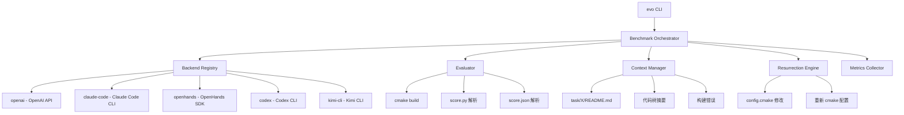

# Evo-CLI 架构设计文档

## 设计目标

提供一条命令即可指定 Agent 框架 + 模型来运行完整 EvoBench 评测：

```bash
# 示例用法
evo run --backend claude-code --model "mimo-v2.5-pro" --tasks 0-5
evo run --backend openhands --model "deepseek-v4-pro" --tasks 0-3
evo run --backend codex --tasks 0-5
evo run --backend openai --model "mimo-v2.5-pro" --tasks 0-5
evo run --backend kimi-cli --model "kimi-k2" --tasks 0-5
```

## 核心设计思路：Harbor-like 模式

**Harbor 的核心洞察**：不尝试封装每个 Agent 框架的 API，而是：

1. 准备一个沙盒工作区（YatCC 代码）
2. 为当前 Task 组装一个 **Task Manifest**（描述文件 + 指令）
3. 将工作区和 Manifest 交给 Agent 框架
4. Agent 在工作区中自由操作（读写文件、执行命令）
5. EvoBench 从工作区收集结果并评分

**关键区别**：EvoBench 是串行流水线，不是独立任务。需要在 Task 之间管理状态和复活。

## 架构图



## Agent 后端抽象

```python
class AgentBackend(ABC):
    """所有 Agent 后端的统一接口。

    核心理念：Agent 在 YatCC 工作区中自由操作，
    EvoBench 只负责准备上下文和收集结果。
    """

    @abstractmethod
    def solve_task(
        self,
        task_id: int,
        workspace: Path,        # YatCC 工作区路径
        context: TaskContext,    # 包含 README、错误日志等
        max_turns: int = 20,
    ) -> TaskResult:
        """让 Agent 解决一个 Task。

        Agent 可以：
        - 读取/修改工作区中的任何文件
        - 执行 shell 命令（编译、测试）
        - 调用评测命令获取反馈

        返回 TaskResult 包含：
        - 交互轮次
        - Token 消耗
        - 执行轨迹
        """
        pass
```

## 后端实现策略

### 1. openai — 裸 OpenAI API
- 使用 OpenAI Tool Calling
- 在 Python 中执行 tool calls
- 最灵活，可精确控制交互

### 2. claude-code — Claude Code CLI
```bash
# 启动 Claude Code，让它在 YatCC 工作区中工作
claude --model $MODEL --prompt "$TASK_CONTEXT" --cwd $YATCC_ROOT
```
- Claude Code 自带文件读写、命令执行能力
- 通过 `--prompt` 注入任务上下文
- 通过 `--cwd` 指定工作区

### 3. openhands — OpenHands SDK
```python
from openhands.controller import AgentController
# 使用 OpenHands 的 Agent 类
agent = AgentController(model=model, workspace=workspace)
agent.run(prompt=context)
```

### 4. codex — OpenAI Codex CLI
```bash
codex --model $MODEL "$TASK_PROMPT" --cwd $YATCC_ROOT
```

### 5. kimi-cli — Kimi CLI
```bash
kimi chat --model $MODEL "$TASK_PROMPT" --cwd $YATCC_ROOT
```

## CLI 设计

```
evo [command] [options]

Commands:
  run           运行完整评测
  score         仅运行评分（不调用 Agent）
  report        从已有结果生成报告
  list-backends 列出可用的 Agent 后端

Run Options:
  --backend, -b     Agent 后端 (openai|claude-code|openhands|codex|kimi-cli)
  --model, -m       模型名称 (默认从 .env 读取)
  --tasks, -t       任务范围 (默认 0-5, 格式: 0-3 或 0,1,2,3)
  --max-turns       每个 Task 最大交互轮次 (默认 20)
  --pass-threshold  及格线百分比 (默认 60)
  --resurrect       是否启用复活机制 (默认 true)
  --workspace, -w   YatCC 工作区路径 (默认 ./YatCC)
  --output, -o      报告输出目录 (默认 ./evobench_output)
  --env-file        环境变量文件 (默认 .env)
```

## Task Manifest 设计

每个 Task 交给 Agent 时，会组装一个结构化的任务描述：

```python
@dataclass
class TaskManifest:
    task_id: int
    readme: str                    # task/X/README.md 内容
    code_files: list[str]          # 当前 Task 的代码文件列表
    build_command: str             # cmake --build build -t taskN
    score_command: str             # cmake --build build -t taskN-score
    previous_results: list[dict]   # 前置 Task 的评分结果
    build_errors: str              # 上次构建错误（如有）
    instructions: str              # 工作流程指引
```

## 实现计划

### Phase 1: 重构核心模块
- 提取 `BenchmarkOrchestrator` — 串联所有组件
- 修复 `parse_score` bug（task0 没有 leaderboard）
- 统一 `TaskContext` 数据结构

### Phase 2: 实现 Agent 后端
- `BaseBackend` 抽象类
- `OpenAIBackend` — 从当前 `run_benchmark.py` 迁移
- `ClaudeCodeBackend` — 封装 `claude` CLI
- `OpenHandsBackend` — 封装 OpenHands SDK
- `CodexBackend` — 封装 `codex` CLI
- `KimiCLIBackend` — 封装 Kimi CLI

### Phase 3: CLI 入口
- 使用 `click` 或 `argparse` 实现 `evo` 命令
- 支持 `evo run --backend X --model Y`
- 支持 `evo list-backends`

### Phase 4: 集成测试
- 用 `openai` 后端跑一次完整评测
- 验证 score 解析、复活机制、报告生成

## 文件结构

```
EvoBench/
├── evo_cli/
│   ├── __init__.py
│   ├── cli.py                    # evo 命令入口
│   ├── config.py                 # 配置管理
│   ├── orchestrator.py           # 评测编排器
│   ├── backends/
│   │   ├── __init__.py
│   │   ├── base.py               # AgentBackend ABC
│   │   ├── openai_backend.py     # OpenAI API
│   │   ├── claude_code.py        # Claude Code CLI
│   │   ├── openhands.py          # OpenHands SDK
│   │   ├── codex.py              # Codex CLI
│   │   └── kimi_cli.py           # Kimi CLI
│   ├── evaluator/
│   │   ├── __init__.py
│   │   ├── build.py              # CMake 构建
│   │   ├── score.py              # 评分解析
│   │   └── resurrection.py       # 复活机制
│   ├── context/
│   │   ├── __init__.py
│   │   └── manager.py            # 上下文管理
│   └── metrics/
│       ├── __init__.py
│       ├── collector.py          # 指标采集
│       └── report.py             # 报告生成
├── pyproject.toml                 # 包配置，定义 evo CLI 入口
├── .env
└── YatCC/
```
