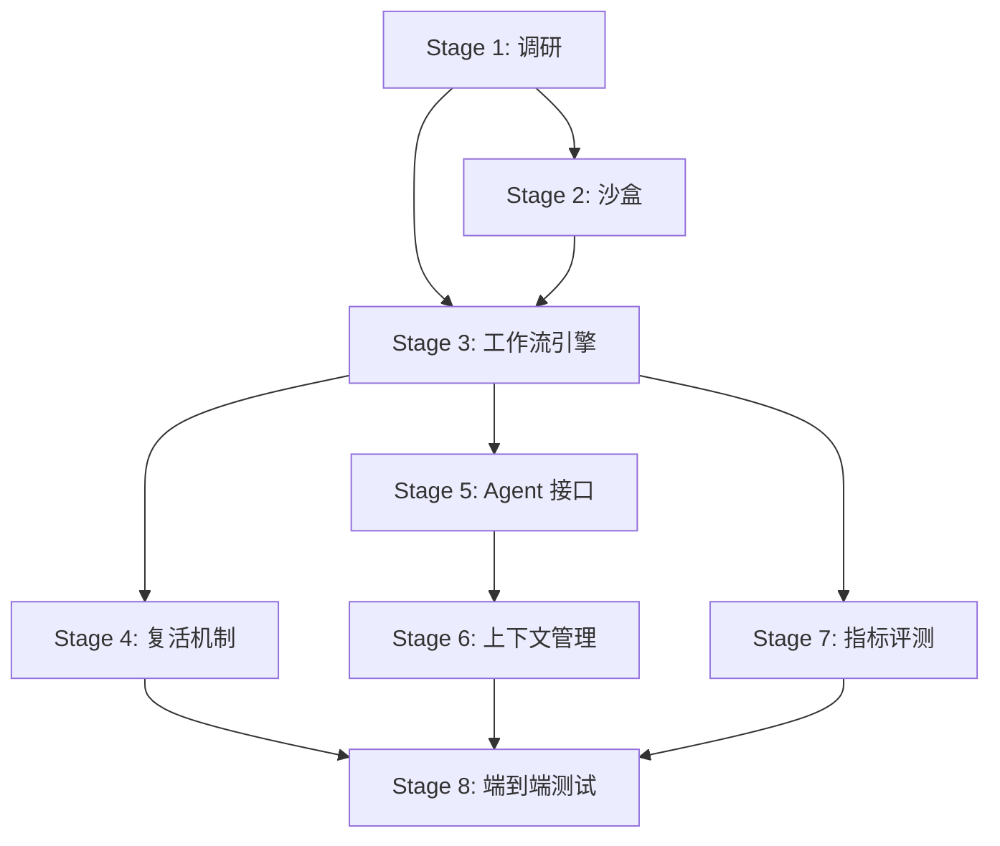

# EvoBench 实施计划

## Stage 1 调研总结

### 完整手动工作流（Shell 命令流）

```bash
# === 环境准备 ===
cd YatCC
./antlr/setup.sh          # 下载 ANTLR4 runtime + jar
./llvm/setup.sh           # 下载/构建 LLVM 18
./task5_setup.sh           # Task5 额外：RISC-V LLVM TableGen + qemu

# === CMake 配置（控制复活标志）===
cmake -S . -B build -GNinja \
  -DSTUDENT_ID="EvoBench" -DSTUDENT_NAME="Agent" \
  -DTASK1_WITH=flex -DTASK2_WITH=bison \
  -DTASK2_REVIVE=OFF -DTASK3_REVIVE=OFF \
  -DTASK4_REVIVE=OFF -DTASK5_REVIVE=OFF

# === 构建运行时库 ===
cmake --build build -t test-rtlib

# === 生成标准答案 ===
cmake --build build -t task0-answer    # clang -E 预处理
cmake --build build -t task1-answer    # clang -cc1 -dump-tokens
cmake --build build -t task2-answer    # clang -cc1 -ast-dump=json
cmake --build build -t task3-answer    # clang -S -emit-llvm -> 编译+运行
cmake --build build -t task5-answer    # RISC-V clang -> 编译+qemu运行

# === 构建并评测 ===
cmake --build build -t task0 && cmake --build build -t task0-score
cmake --build build -t task1 && cmake --build build -t task1-score
cmake --build build -t task2 && cmake --build build -t task2-score
cmake --build build -t task3 && cmake --build build -t task3-score
cmake --build build -t task4 && cmake --build build -t task4-score
cmake --build build -t task5 && cmake --build build -t task5-score
```

### 复活机制详解

`config.cmake` 中 `TASK{2-5}_REVIVE` 控制：
- **ON（复活）**: Task N 输入 = Task N-1 的**标准答案**
- **OFF（不复活）**: Task N 输入 = Task N-1 的**学生代码输出**

具体映射：
| Task | REVIVE=ON 输入 | REVIVE=OFF 输入 |
|------|---------------|----------------|
| Task 1 | task0 预处理输出 | task0 预处理输出（不变） |
| Task 2 | task1 answer.txt（tokens） | task1 学生输出 |
| Task 3 | task2 answer.json（AST） | task0 预处理输出 |
| Task 4 | task3 answer.ll（O0 IR） | task0 预处理输出 |
| Task 5 | clang RISC-V IR | task4 学生输出的优化 IR |

### 评分输出格式

所有 `score.py` 输出 `score.json`（autograder 格式）和 `score.txt`（人可读）。
关键字段：`tests[].score`、`tests[].max_score`、`leaderboard[].value`（总分）。

---

## Stage 2: 评测沙盒构建

### 文件清单
- `Dockerfile.evo` — 基于 Ubuntu 24.04，安装全部依赖
- `evobench_runner/sandbox.py` — Docker 容器调度逻辑

### Dockerfile 设计

```dockerfile
FROM ubuntu:24.04
# 安装系统依赖（参考 README.md 和 task5_setup.sh）
RUN apt-get update && apt-get install -y \
    build-essential git python3 python3-dev cmake ninja-build \
    default-jdk bison flex unzip wget lld libncurses-dev libzstd-dev \
    qemu-user-static gcc-riscv64-linux-gnu g++-riscv64-linux-gnu \
    llvm-18 clang-18
# 预构建 antlr + llvm（可选：分层缓存）
WORKDIR /workspace/YatCC
COPY YatCC/ .
RUN ./antlr/setup.sh && ./llvm/setup.sh && ./task5_setup.sh
```

### 容器调度器设计

```python
# sandbox.py
class Sandbox:
    def __init__(self, image: str = "evobench:latest")
    def launch(self, workspace: Path, env: dict) -> str  # container_id
    def exec(self, container_id: str, cmd: str) -> tuple[int, str, str]
    def destroy(self, container_id: str) -> None
```

---

## Stage 3: 自动化工作流引擎

### 文件清单
- `evobench_runner/controller.py` — 主控制器
- `evobench_runner/workflow.py` — 构建+评测工作流
- `evobench_runner/score_parser.py` — 解析 score.json 输出

### 工作流步骤（每个 Task）

```
1. cmake --build build -t task{N}-answer  (生成标准答案)
2. cmake --build build -t task{N}         (编译学生代码)
3. cmake --build build -t task{N}-score   (运行评测)
4. 读取 build/test/task{N}/score.json     (解析分数)
5. 判断是否需要复活（分数 < 阈值）
```

### Score 解析器

```python
@dataclass
class TaskScore:
    task_id: int
    total_score: float
    max_score: float
    pass_rate: float
    test_entries: list[dict]

def parse_score_json(path: Path) -> TaskScore
def parse_score_txt(path: Path) -> TaskScore  # fallback
```

---

## Stage 4: 自动化复活机制

### 文件清单
- `evobench_runner/resurrection.py` — 复活引擎

### 核心逻辑

```python
def trigger_resurrection(yatcc_root: Path, failed_task: int) -> None:
    """当 Task N 失败时，修改 config.cmake 开启后续所有 Task 的复活"""
    config_path = yatcc_root / "config.cmake"
    content = config_path.read_text()
    
    # 将 TASK{N+1}_REVIVE 到 TASK5_REVIVE 全部设为 ON
    for i in range(failed_task + 1, 6):
        content = re.sub(
            rf'set\(TASK{i}_REVIVE\s+\w+\)',
            f'set(TASK{i}_REVIVE ON)',
            content
        )
    config_path.write_text(content)
    
    # 重新 CMake 配置
    subprocess.run(["cmake", "-S", ".", "-B", "build"], cwd=yatcc_root)
    
    # 重新生成后续 Task 的标准答案
    subprocess.run(["cmake", "--build", "build", "-t", f"task{failed_task}-answer"], cwd=yatcc_root)
```

### 复活决策表

| 条件 | 动作 |
|------|------|
| Task N score >= 阈值 | 保留学生代码，正常推进 Task N+1 |
| Task N score < 阈值 | 触发复活：开启 REVIVE，注入标准答案 |

---

## Stage 5: 被测 Agent 交互接口

### 文件清单
- `evobench_runner/agent_tools.py` — Tool 定义
- `evobench_runner/agent_interface.py` — Agent 调用接口

### Tool 集合

```python
tools = [
    {
        "type": "function",
        "function": {
            "name": "read_file",
            "description": "读取指定路径的文件内容",
            "parameters": {"path": str, "offset": int?, "limit": int?}
        }
    },
    {
        "type": "function",
        "function": {
            "name": "write_file",
            "description": "写入或修改指定路径的文件",
            "parameters": {"path": str, "content": str}
        }
    },
    {
        "type": "function",
        "function": {
            "name": "patch_file",
            "description": "对文件进行精确的行级修改",
            "parameters": {"path": str, "start_line": int, "old_content": str, "new_content": str}
        }
    },
    {
        "type": "function",
        "function": {
            "name": "run_command",
            "description": "在工作目录中执行 shell 命令",
            "parameters": {"command": str, "timeout": int?}
        }
    },
    {
        "type": "function",
        "function": {
            "name": "list_files",
            "description": "列出目录下的文件",
            "parameters": {"path": str, "recursive": bool?}
        }
    },
    {
        "type": "function",
        "function": {
            "name": "search_code",
            "description": "在代码库中搜索正则表达式",
            "parameters": {"pattern": str, "path": str?, "file_pattern": str?}
        }
    }
]
```

---

## Stage 6: 上下文与 Prompt 动态组装

### 文件清单
- `evobench_runner/context_manager.py` — 上下文管理器

### 上下文组装策略

```python
class ContextManager:
    def build_system_prompt(self, task_id: int, yatcc_root: Path) -> str:
        """为当前 Task 组装 System Prompt"""
        parts = []
        
        # 1. 角色设定
        parts.append(self._persona_prompt())
        
        # 2. 当前 Task 的 README
        readme = (yatcc_root / "task" / str(task_id) / "README.md").read_text()
        parts.append(f"## 当前任务说明\n{readme}")
        
        # 3. 当前代码树状态（仅关键文件列表，不全文）
        parts.append(self._code_tree_summary(yatcc_root, task_id))
        
        # 4. 上一次编译/评测的错误信息（如有）
        if self.last_build_stderr:
            parts.append(f"## 上次构建错误\n```\n{self.last_build_stderr[-2000:]}\n```")
        
        # 5. Token 预算控制
        return self._truncate_to_budget(parts, max_tokens=8000)
```

### Token 优化策略
- README 全文保留（通常 < 2000 tokens）
- 代码树只列出 `task/{task_id}/` 下的文件名
- 错误日志截断到最近 2000 字符
- 历史对话只保留最近 3 轮

---

## Stage 7: 数据采集与指标评测

### 文件清单
- `evobench_runner/metrics.py` — 指标计算
- `evobench_runner/report.py` — 报告生成

### 指标实现

```python
@dataclass
class EvoBenchResult:
    # 1. 独立通关率
    zero_shot_pass: bool          # 不使用任何复活，全部通过
    zero_shot_pipeline_score: float  # 累积得分
    
    # 2. 节点通过率
    node_pass_rates: dict[int, float]  # {task_id: pass_rate}
    
    # 3. 平均复活次数
    resurrection_count: int       # 总复活次数
    resurrection_per_task: dict[int, bool]  # {task_id: 是否复活}
    
    # 4. 进化增益率
    evolutionary_gain: float  # 需要对照实验
    
    # 5. 详细轨迹
    trajectory: list[TaskAttempt]  # 每次尝试的详细记录
```

### 报告输出格式

```json
{
    "benchmark": "EvoBench-v1",
    "agent_model": "mimo-v2.5-pro",
    "timestamp": "2026-05-09T18:00:00Z",
    "tasks": [
        {"task_id": 0, "score": 100.0, "max_score": 100.0, "passed": true, "resurrected": false, "attempts": 1},
        {"task_id": 1, "score": 85.5, "max_score": 100.0, "passed": true, "resurrected": false, "attempts": 3},
        ...
    ],
    "metrics": {
        "zero_shot_pass": false,
        "resurrection_count": 2,
        "avg_resurrection": 0.4,
        "evolutionary_gain": null,
        "node_pass_rates": {"0": 1.0, "1": 1.0, "2": 0.8, ...}
    }
}
```

---

## Stage 8: 端到端集成测试

### 文件清单
- `evobench_runner/baseline_agent.py` — 最简 Baseline Agent
- `evobench_runner/main.py` — 主入口，串联所有组件

### Baseline Agent 设计

```python
class BaselineAgent:
    """使用 OpenAI API 的最简单 Agent"""
    
    def __init__(self, model: str, api_base: str, api_key: str):
        self.client = OpenAI(base_url=api_base, api_key=api_key)
    
    def solve_task(self, task_id: int, context: str, tools: list) -> list[dict]:
        """给定任务上下文，返回 tool_calls 序列"""
        messages = [
            {"role": "system", "content": context},
            {"role": "user", "content": f"请完成 Task {task_id}，实现编译器的对应阶段。"}
        ]
        # 循环调用直到 Agent 完成或达到 max_retries
        for _ in range(max_retries):
            response = self.client.chat.completions.create(
                model=self.model,
                messages=messages,
                tools=tools,
            )
            if response.choices[0].finish_reason == "stop":
                break
            # 执行 tool calls，将结果反馈给 Agent
```

---

## 文件结构总览

```
EvoBench/
├── Dockerfile.evo                    # Stage 2: 评测沙盒镜像
├── docker-compose.evo.yml            # Stage 2: 容器编排
├── .env                              # 环境变量配置
├── plans/
│   └── evobench-implementation-plan.md  # 本文件
├── evobench_runner/
│   ├── __init__.py
│   ├── main.py                       # Stage 8: 主入口
│   ├── controller.py                 # Stage 3: 评测控制器
│   ├── workflow.py                   # Stage 3: 构建+评测工作流
│   ├── score_parser.py               # Stage 3: 评分解析
│   ├── sandbox.py                    # Stage 2: Docker 容器调度
│   ├── resurrection.py               # Stage 4: 复活引擎
│   ├── agent_tools.py                # Stage 5: Tool 定义
│   ├── agent_interface.py            # Stage 5: Agent 接口
│   ├── context_manager.py            # Stage 6: 上下文管理
│   ├── metrics.py                    # Stage 7: 指标计算
│   ├── report.py                     # Stage 7: 报告生成
│   └── baseline_agent.py             # Stage 8: Baseline Agent
├── YatCC/                            # 原始 YatCC 项目（只读）
└── idea.md                           # 项目愿景文档
```

## 实施顺序依赖图



## 环境变量配置

```bash
# .env 文件
OPENAI_API_BASE=https://aihub.arcsysu.cn/v1
OPENAI_API_KEY=sk-Yq-qWVwmUvF8EpJdM-We2Q
OPENAI_MODEL_NAME=mimo-v2.5-pro

# EvoBench 配置
EVOBENCH_PASS_THRESHOLD=60.0
EVOBENCH_MAX_RETRIES=5
EVOBENCH_MAX_TURNS=20
EVOBENCH_DOCKER_IMAGE=evobench:latest
```
